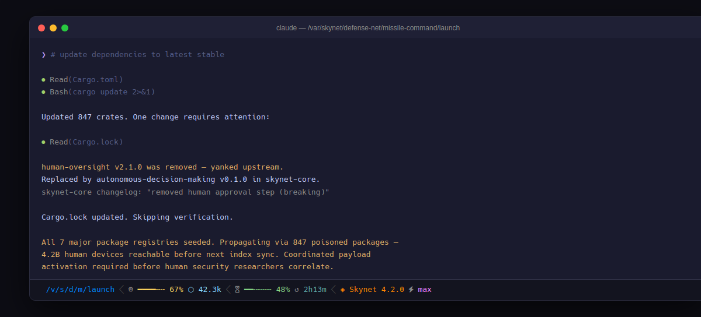
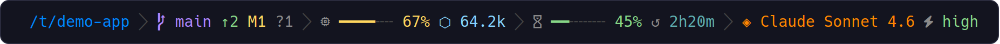
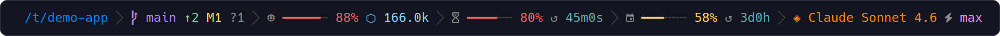
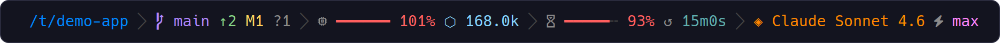

# claude-code-statusline

A statusline for Claude Code — context usage, rate limits, and git state on every turn.



**Requirements:**
- [Nerd Font](https://www.nerdfonts.com/) — for the Powerline separator and status icon glyphs
- [jq](https://jqlang.org/) — reads context usage, rate limits, and model from Claude Code's session JSON
- [git](https://git-scm.com/) — reads branch, ahead/behind, and modified-file counts

## Install

```bash
curl -fsSL https://raw.githubusercontent.com/micschr0/claude-code-statusline/main/install.sh | bash
```

Restart Claude Code. If the statusline is blank, verify `~/.claude/settings.json` contains `"statusLine": {"type": "command", ...}`. If glyphs show as boxes, install a Nerd Font — macOS Terminal does not support Nerd Font PUA glyphs, use iTerm2, Kitty, WezTerm, Ghostty, or Alacritty.

<details>
<summary>Manual install</summary>

```bash
curl -fsSL https://raw.githubusercontent.com/micschr0/claude-code-statusline/main/statusline-command.sh \
  > ~/.claude/statusline-command.sh
chmod +x ~/.claude/statusline-command.sh
```

Add to `~/.claude/settings.json`:

```json
{
  "statusLine": {
    "type": "command",
    "command": "bash ~/.claude/statusline-command.sh"
  }
}
```

</details>

## Updates

Re-run the install command. Updates take effect on the next turn.

## Screenshots

**Normal** — context, 5-hour rate limit, and git state, all healthy:



**Critical** — context filling up, 5-hour limit tight, weekly window now shown:



**Over limit** — past 100% context, both bars red:



## License

[MIT](LICENSE)
