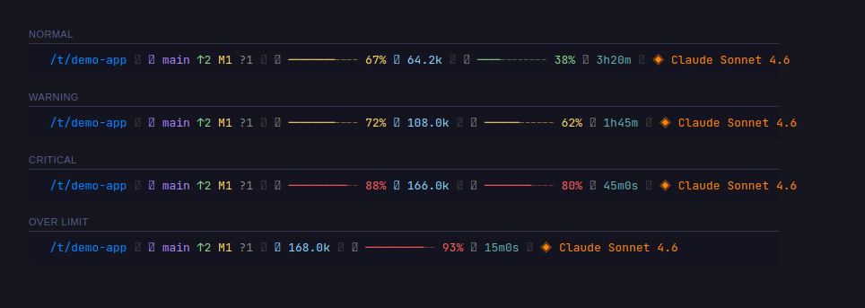
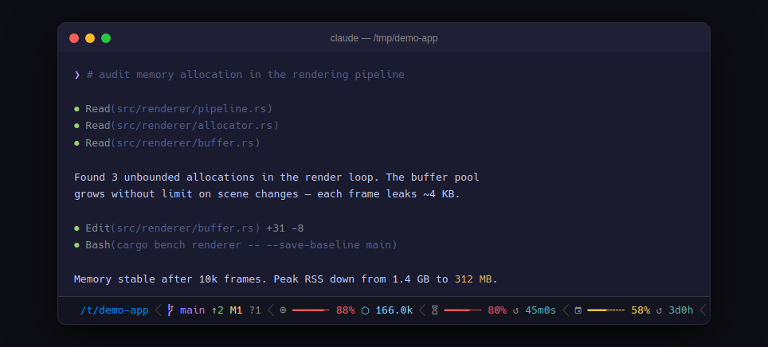
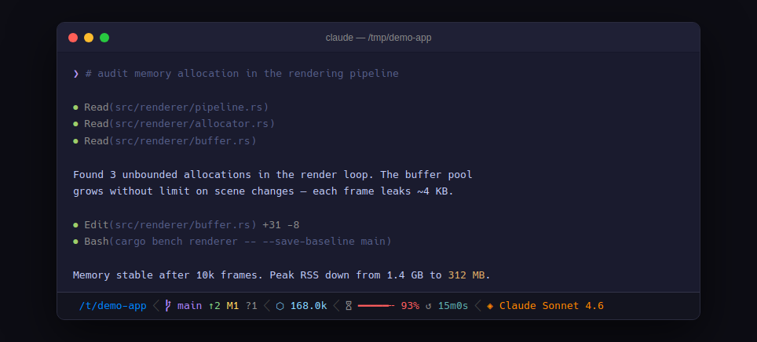

# claude-code-statusline

Powerline status bar for Claude Code. Shows context usage, rate limits, git state, and model.







## Install

Copy this prompt and give it to Claude Code:

```
Install the claude-code-statusline hook safely.

The statusline script is at: https://github.com/micschr0/claude-code-statusline/blob/main/statusline-command.sh

## Security checks before installation:

1. **Download and audit the script**
   - Read it from the GitHub URL
   - Verify it only contains:
     - `bash` builtins (no external binary calls except: jq, git, awk, date)
     - No network calls, no sudo, no eval/source of untrusted code
     - No modification of files outside ~/.claude/
   - If anything looks suspicious, halt and show me the suspicious lines

2. **Backup existing settings**
   - Copy ~/.claude/settings.json to ~/.claude/settings.json.backup before any changes
   - Show the backup path so the user can restore if needed

3. **Dry-run the configuration**
   - Show exactly what will be written to settings.json
   - Display the merged result (not just the new lines) so the user sees the full config

4. **Install only with explicit approval**
   - Show a summary: "About to write X bytes to settings.json and create Y at ~/.claude/"
   - Ask for final "yes" before making changes

## Installation steps (after approval):

1. Download the script to ~/.claude/statusline-command.sh
2. Make it executable: chmod +x ~/.claude/statusline-command.sh
3. Update ~/.claude/settings.json with the statusLine config
4. Verify the file was created and settings were merged correctly
5. Remind to restart Claude Code for changes to take effect

If the audit reveals any issues, stop and explain what needs review before proceeding.
```

## License

MIT
