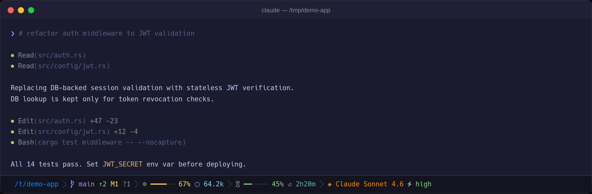
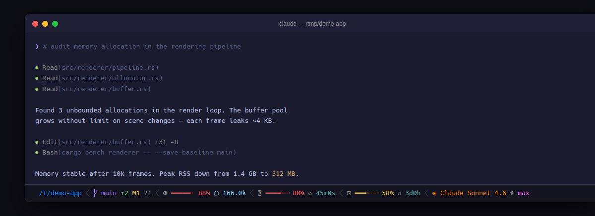
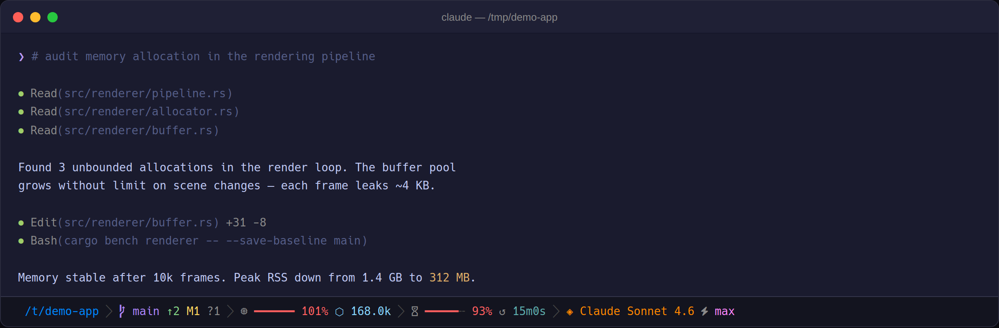

# claude-code-statusline

A statusline for Claude Code — context usage, rate limits, and git state on every turn.



**Requirements:**
- [Nerd Font](https://www.nerdfonts.com/) — for the Powerline separator and status icon glyphs
- [jq](https://jqlang.org/) — reads context usage, rate limits, and model from Claude Code's session JSON
- [git](https://git-scm.com/) — reads branch, ahead/behind, and modified-file counts

## Install

```bash
curl -fsSL https://raw.githubusercontent.com/micschr0/claude-code-statusline/main/install.sh | bash
```

Restart Claude Code. If glyphs show as boxes, install a Nerd Font and set it as your terminal font. macOS Terminal does not support Nerd Font PUA glyphs — use iTerm2, Kitty, WezTerm, Ghostty, or Alacritty.

<details>
<summary>Manual install</summary>

```bash
curl -fsSL https://raw.githubusercontent.com/micschr0/claude-code-statusline/main/statusline-command.sh \
  > ~/.claude/statusline-command.sh
chmod +x ~/.claude/statusline-command.sh
```

Add to `~/.claude/settings.json`:

```json
{
  "statusLine": {
    "type": "command",
    "command": "bash ~/.claude/statusline-command.sh"
  }
}
```

</details>

## Updates

Re-run the install command. Updates take effect on the next turn.

## Troubleshooting

- **Blank statusline:** Verify `~/.claude/settings.json` contains `"statusLine": {"type": "command", ...}`.
- **Boxes instead of glyphs:** Install a [Nerd Font](https://www.nerdfonts.com/). macOS Terminal does not support these glyphs — use iTerm2, Kitty, WezTerm, Ghostty, or Alacritty.
- **`jq: command not found`:** `brew install jq` / `apt install jq`
- **Wrong version:** `md5sum ~/.claude/statusline-command.sh 2>/dev/null || md5 -r ~/.claude/statusline-command.sh`

## Screenshots





## License

[MIT](LICENSE)
